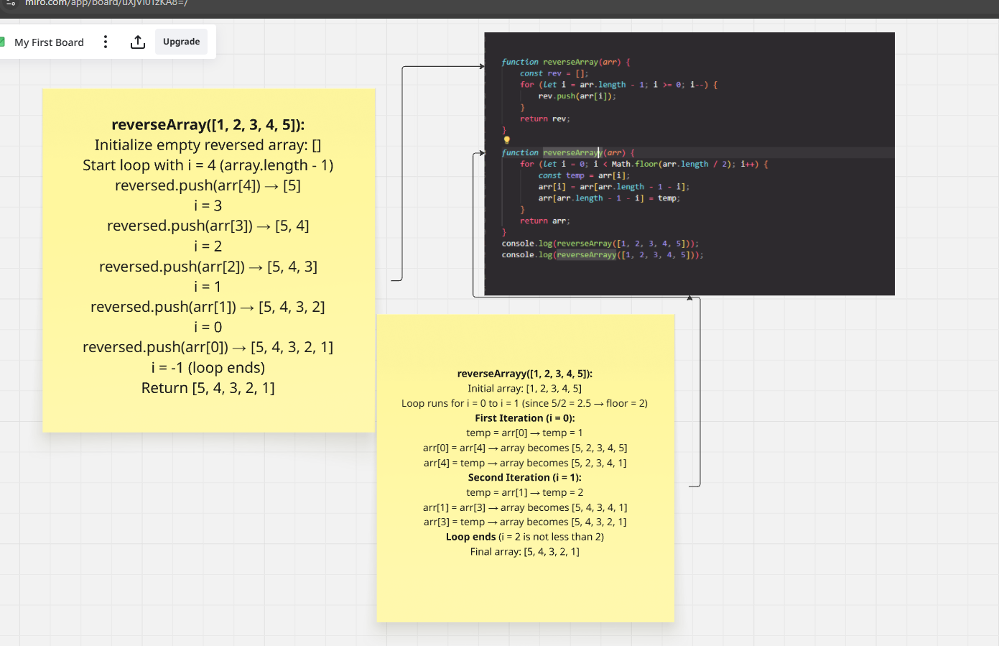
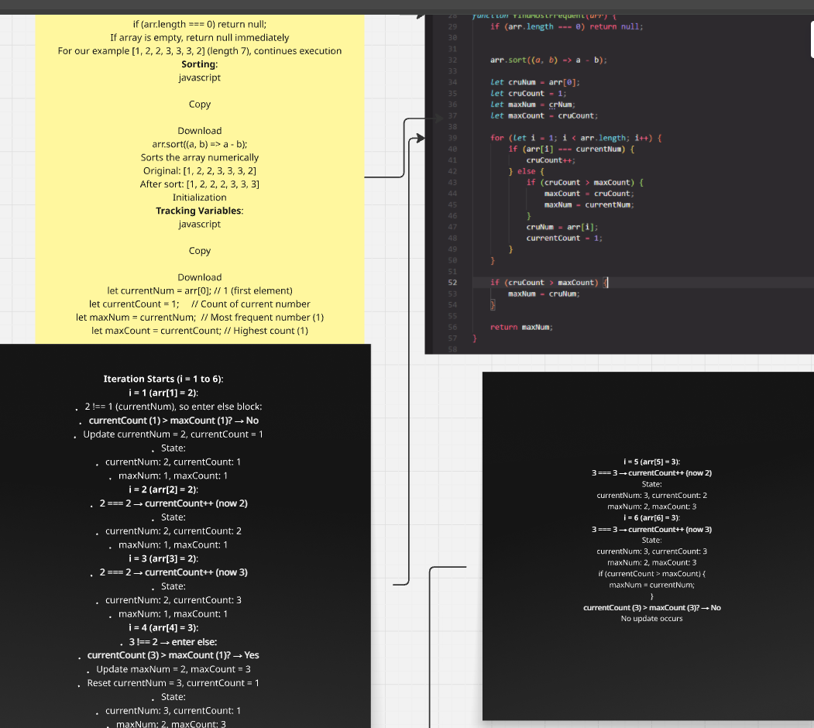
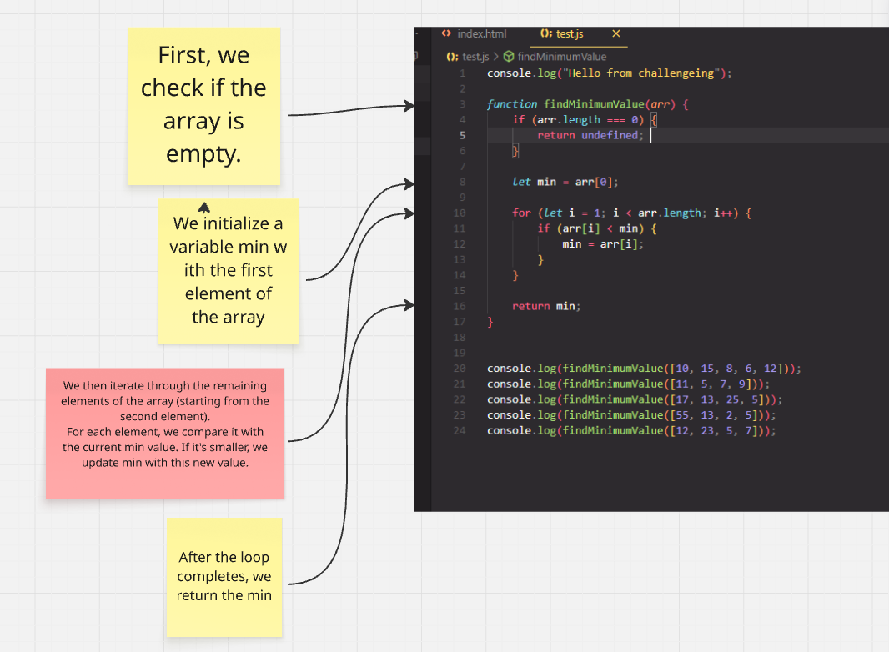
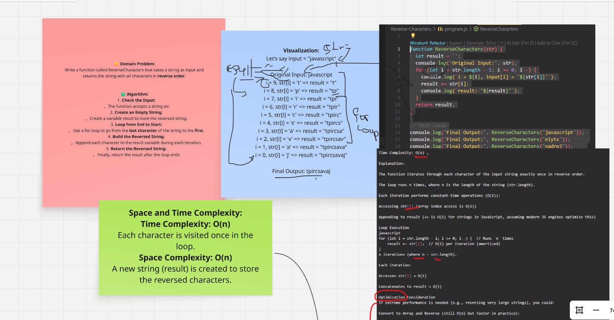
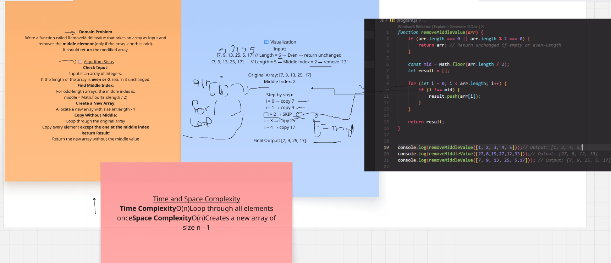
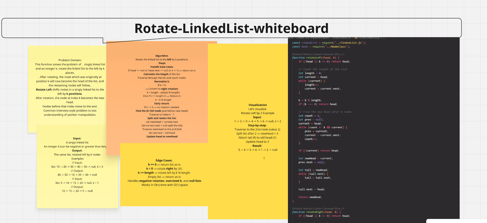

# Whiteboard Challenges

[](https://github.com/mahmoodaaa/challenges-and-data-structures)

## Profile


## Table of Contents
- [Array Reversal](#array-reversal)
- [Most Frequent Number](#most-frequent-number)
- [Minimum Value](#minimum-value)
- [Reverse Characters](#reverse-characters)
- [Remove Middle Value](#remove-middle-value)
- [Linked List Implementations](#linked-list-implementations)

## Array Reversal

### Description
Create a function named ArrayReversal that accepts an array as its parameter.
Without using any built-in methods, return a new array where the elements are in reverse order.

### Approach
1. Create a new array to store the reversed elements
2. Iterate through the input array from the last element to the first
3. Add each element to the new array
4. Return the new array

### Example
```javascript
Input: [1, 2, 3, 4, 5]
Output: [5, 4, 3, 2, 1]
```

### Whiteboard Image


## Most Frequent Number

### Description
Create a function that finds the most frequently occurring number in an array.

### Approach
1. Create an object to store number frequencies
2. Iterate through the array and count occurrences
3. Find the number with the highest frequency
4. Return the most frequent number

### Example
```javascript
Input: [1, 2, 3, 2, 4, 2, 5]
Output: 2 (appears 3 times)
```

### Whiteboard Image


## Minimum Value

### Description
Create a function that finds the minimum value in an array of numbers.

### Approach
1. Initialize minimum as the first element
2. Iterate through the array
3. Compare each element with current minimum
4. Update minimum if a smaller value is found
5. Return the minimum value

### Example
```javascript
Input: [34, 15, 88, 2, 99]
Output: 2
```

### Whiteboard Image


## Reverse Characters

### Description
Create a function that reverses the characters in a string without using built-in methods.

### Approach
1. Convert string to array of characters
2. Reverse the array using a custom method
3. Join the characters back into a string
4. Return the reversed string

### Example
```javascript
Input: "hello"
Output: "olleh"
```

### Whiteboard Image


## Remove Middle Value

### Description
Write a function called `RemoveMiddleValue` that takes in an array of integers and removes the middle element if the array length is odd.

### Requirements
- The function must not use built-in methods like `splice`, `slice`, or `filter`.
- Return a new array with the middle value removed.
- If the array length is even or 0, return it unchanged.

### Example
```javascript
Input: [1, 2, 3, 4, 5]
Output: [1, 2, 4, 5]

Input: [27, 8, 15, 73, 27]
Output: [27, 8, 73, 27]

Input: [7, 9, 13, 25, 5, 17]
Output: [7, 9, 13, 25, 5, 17]
```

### Whiteboard Image


## Linked List Implementations

### Description
Create a linked list data structure with basic operations including insertion, deletion, and traversal.

### Whiteboard Images
- 

   #### Whiteboard Reverse-LinkedList
- 

#### Whiteboard Merge-LinkedList
- 


#### Whiteboard Rotate k-by-LinkedList



#### Whiteboard Stack
- 

#### Whiteboard Queue
- 

## Contributing


If you would like to contribute to this project, please fork this repository and submit a pull request.

## License

This project is licensed under the [MIT License](https://opensource.org/licenses/MIT).


