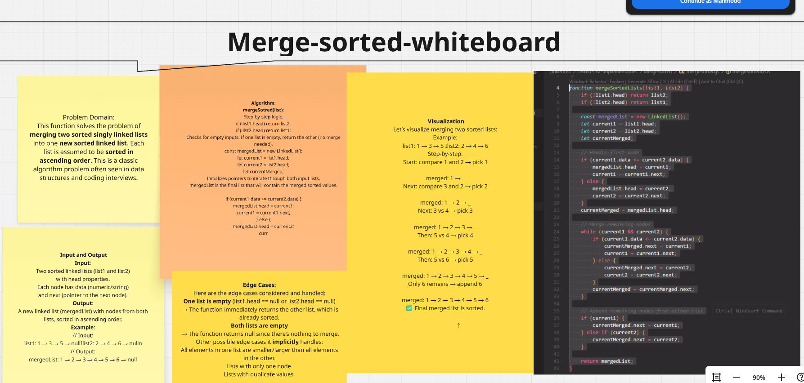

# Merge Sorted Linked Lists

This implementation provides a standalone function to merge two sorted linked lists into a single sorted linked list.

## Problem Domain

The problem requires implementing a method to merge two sorted linked lists into a single sorted linked list. The method should take two sorted linked lists as input and return a new sorted linked list that contains all the elements from both input lists.

## Implementation

The implementation uses two pointers (current1 and current2) to traverse both linked lists simultaneously. It compares the values of nodes pointed by the current pointers and appends the smaller node to the merged list. The pointers are then moved forward accordingly.

## Whiteboard Explanation

Here's a visual representation of the merge process:

### Merge Sorted Whiteboard


### Test Cases


### Output Example

Here's an example of the console output when running the mergeSorted functionality:

```
== Testing Merge Sorted Lists ==

List 1:
1 -> 3 -> 5 -> null
List 2:
2 -> 4 -> 6 -> null

Merged List:
1 -> 2 -> 3 -> 4 -> 5 -> 6 -> null

List 3:
10 -> 20 -> 30 -> null
List 4:
5 -> 15 -> 25 -> 35 -> null

Merged List:
5 -> 10 -> 15 -> 20 -> 25 -> 30 -> 35 -> null

Empty List:
null
List 5:
7 -> 9 -> 11 -> null

Merged List:
7 -> 9 -> 11 -> null
```

## Key Features

- Handles empty lists gracefully
- Preserves sorted order of elements
- Maintains all elements from both input lists
- Handles lists of different lengths
- Handles duplicate values

## Usage

```javascript
const list1 = new LinkedList();
const list2 = new LinkedList();

// Add elements to both lists
list1.addToEnd(1);
list1.addToEnd(3);
list1.addToEnd(5);

list2.addToEnd(2);
list2.addToEnd(4);
list2.addToEnd(6);

// Merge the lists
const mergedList = mergeSortedLists(list1, list2);

// The merged list will be: 1 -> 2 -> 3 -> 4 -> 5 -> 6 -> null
```

## Edge Cases Handled

1. Both lists are empty
2. One list is empty
3. Lists with different lengths
4. Lists with duplicate values
5. Lists with same values

## Testing

The implementation is thoroughly tested with Jest, covering all edge cases and main functionality. The tests can be found in `test/mergeSorted.test.js` and include:
- Merging two empty lists
- Merging when one list is empty
- Merging lists with duplicates
- Merging lists with different lengths
- Handling edge cases with duplicates

## Complexity

- Time Complexity: O(n + m) where n and m are the lengths of the two input lists
- Space Complexity: O(1) additional space (excluding the space for the merged list)
