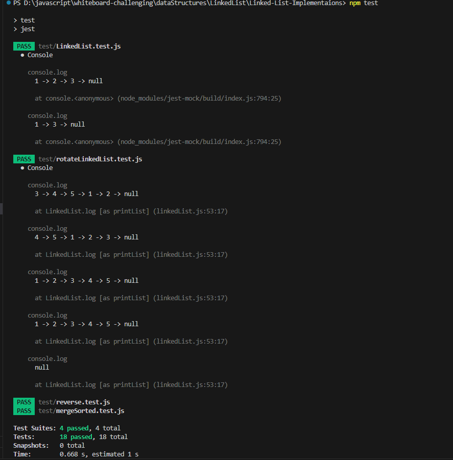
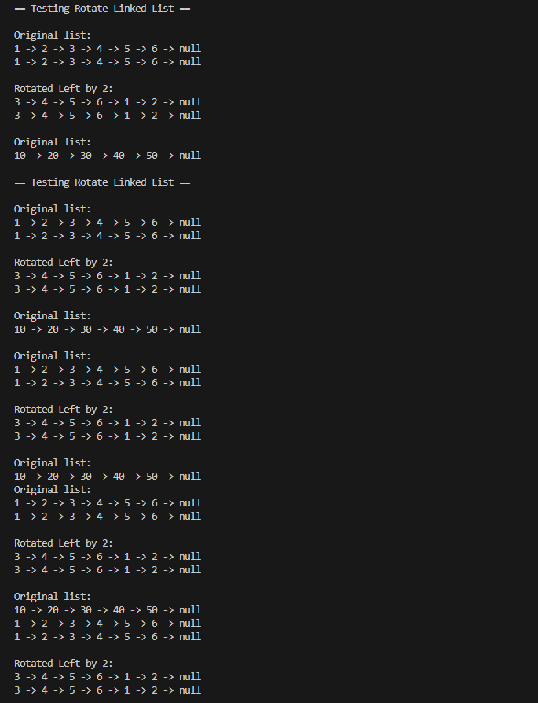
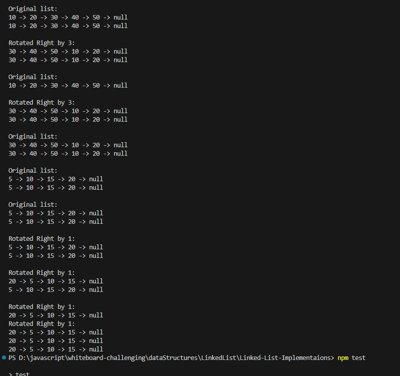

# Linked List Implementation

## Table of Contents
- [Node Class](#node-class)
- [LinkedList Class](#linkedlist-class)
- [Basic Operations](#basic-operations)
- [Reverse Linked List](#reverse-linked-list)
- [Merge Sorted Lists](#merge-sorted-lists)
- [Rotate Linked List](#rotate-linked-list)

## Node Class
The Node class should have properties for storing data and a reference to the next node in the linked list.

## LinkedList Class
The LinkedList class should have a property Node head to store the head of the linked list.

## Basic Operations
The LinkedList class supports functions to:
- add(data): Add a new node with the specified data to the end of the linked list.
- remove(data): Remove the first node with the specified data from the linked list.
- printList(): Print the contents of the list in order.
- includes(data): Check if the linked list contains a node with the specified value.
- insertAt(data, index): Insert a new node with the specified data at the specified index in the linked list.

This project implements a **singly linked list** in JavaScript using a custom `NodeClass` and `LinkedList` class. It includes full test coverage and manual test logic.

---

## 🧠 Problem Domain

Design a linked list with the following operations:
- `addToEnd(data)`
- `removeFirst(data)`
- `includes(data)`
- `insertAt(data, index)`
- `printList()`

---

## 🧪 Inputs and Expected Outputs

| Method         | Input               | Expected Output                  |
|----------------|---------------------|----------------------------------|
| `addToEnd`     | 10, 20, 30          | List: 10 -> 20 -> 30 -> null     |
| `removeFirst`  | 20                  | List: 10 -> 30 -> null           |
| `includes`     | 30                  | Node { data: 30 }                |
| `insertAt`     | 15 at index 1       | List: 10 -> 15 -> 30 -> null     |

---

## 👁️ Visual (Whiteboard)

### `add`

### `include(search)`
.png)

### `insertAt`

### `print`

### `removeFirst`

### `test`

### `test02`

### `whitboard-all`

### `reverseWhiteboard`

### `add-reversere-app`

### `Merge Sorted Linked Lists`

### Rotate LinkedList Whiteboard

### Test Cases

### Output Cases

