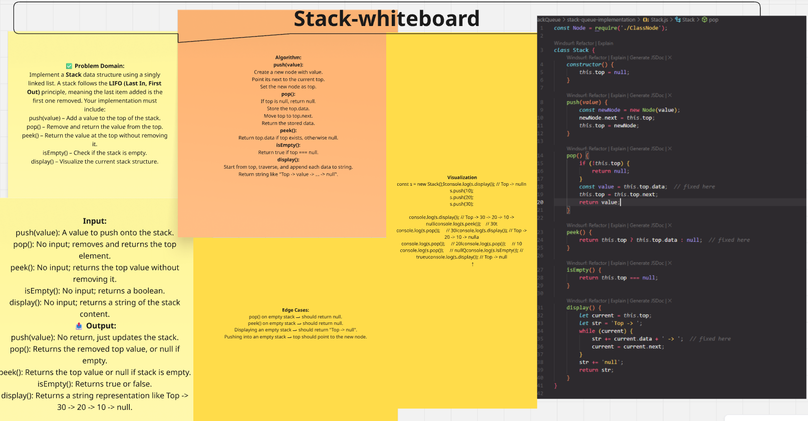
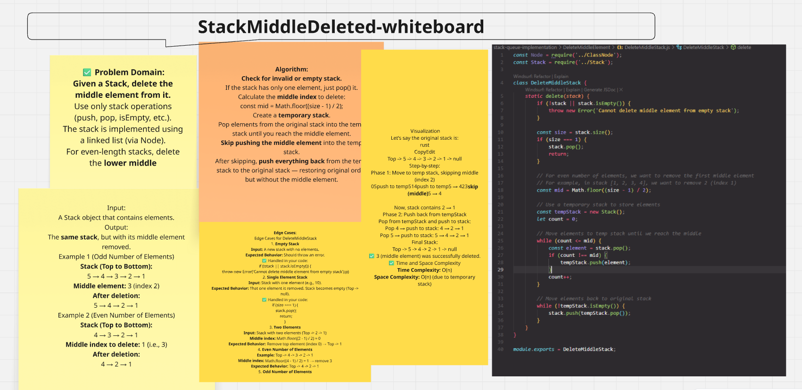
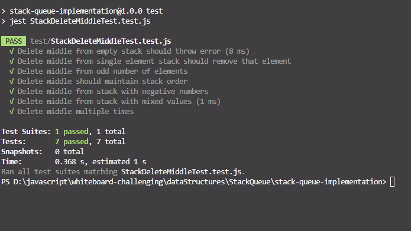
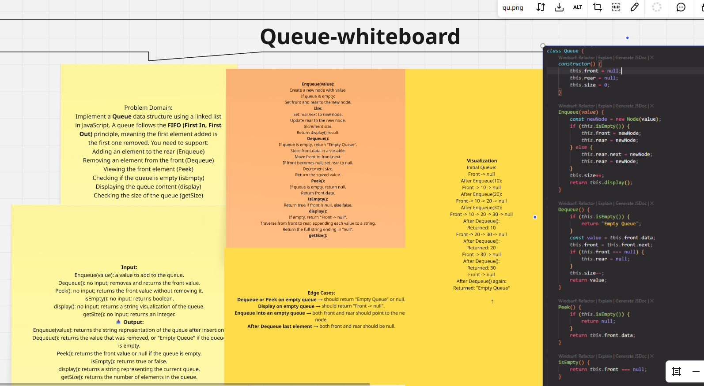

# Stack and Queue Implementation

This repository contains implementations of Stack and Queue data structures in JavaScript.

## Stack Implementation

A Stack is a Last In First Out (LIFO) data structure. Here's how it works:



Key operations:
- `push(item)`: Adds an item to the top of the stack
- `pop()`: Removes and returns the top item from the stack
- `peek()`: Returns the top item without removing it
- `isEmpty()`: Checks if the stack is empty
- `size()`: Returns the number of items in the stack





## Queue Implementation

A Queue is a First In First Out (FIFO) data structure. Here's how it works:



Key operations:
- `enqueue(item)`: Adds an item to the end of the queue
- `dequeue()`: Removes and returns the first item from the queue
- `peek()`: Returns the first item without removing it
- `isEmpty()`: Checks if the queue is empty
- `size()`: Returns the number of items in the queue

## Usage

Here's how to use the implementations:

```javascript
// Stack Usage
const stack = new Stack();
stack.push(10);
stack.push(20);
console.log(stack.pop()); // 20
console.log(stack.peek()); // 10

// Queue Usage
const queue = new Queue();
queue.enqueue(10);
queue.enqueue(20);
console.log(queue.dequeue()); // 10
console.log(queue.peek()); // 20
```

## Implementation Details

Both implementations use arrays as the underlying data structure for simplicity and efficiency. The stack operations are O(1) time complexity, while queue operations are optimized to be O(1) amortized time complexity.

## Testing

Each implementation includes test cases to verify correctness. You can run the tests using:

```bash
npm test
```

## Contributing

Feel free to contribute by:
1. Adding more test cases
2. Implementing additional features
3. Optimizing existing code
4. Adding more examples

## License

This code is available under the MIT License.
